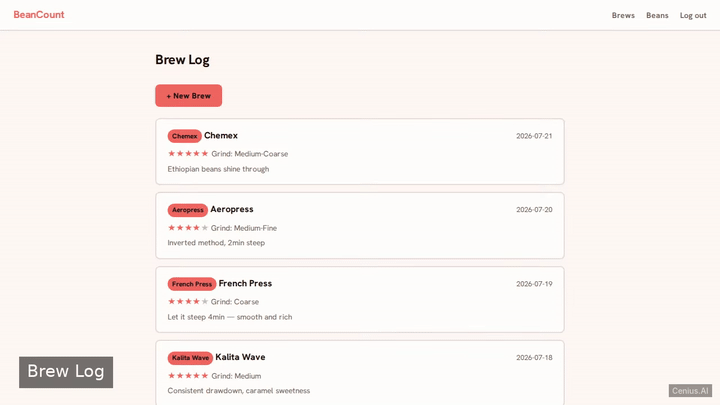
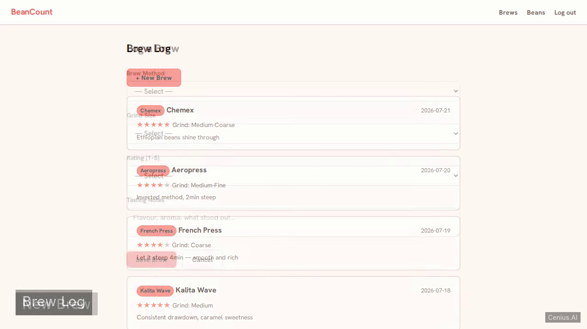
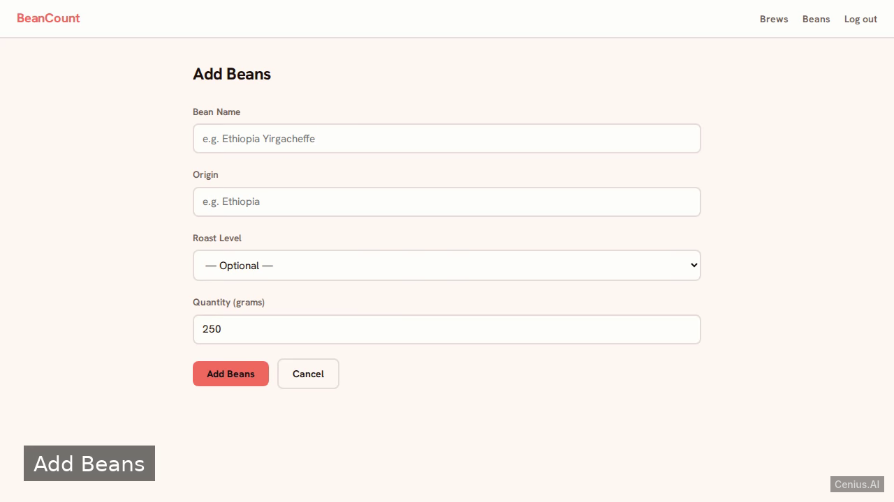

# BeanCount — production-ready Full-stack app recipe manager starter

This repository contains the complete source for **BeanCount**, an open-source recipe manager built with Full-stack app. A coffee-brew journal built with Nim 2.0 and Jester. Everything BeanCount needs to run is here — code, seed data, install scripts. Apache-2.0-licensed — use BeanCount commercially, self-host it, or [remix BeanCount on cenius.ai](https://cenius.ai/marketplace/p/beancount?ref=gh&utm_campaign=beancount-webapp) to make it yours.


[](LICENSE)  [](https://cenius.ai)

[](https://cenius.ai/marketplace/p/beancount?ref=gh&utm_campaign=beancount-webapp)

> **▶ [Open & edit in cenius.ai](https://cenius.ai/marketplace/p/beancount?ref=gh&utm_campaign=beancount-webapp)** — one click to an editable workspace: describe changes in plain English, get an instant preview, one-click deploy and host. Modifications made on the platform come with full rebrand & relicense rights.

_Local clone? See [Quick start](#quick-start) below. cenius.ai is the zero-setup path._

## Demo



▶ **[See it in action](https://cenius.ai/marketplace/p/beancount?ref=gh&utm_campaign=beancount-webapp)** — full demo on the project page · [MP4](.github/media/demo.mp4)

## Screenshots

  

## Features

- User Login
- Brew Log List
- New Brew Entry
- Bean Inventory

## Quick start

```bash
./install.sh   # installs dependencies + seeds demo data
```

See [`INSTALL.md`](INSTALL.md) for full setup and usage instructions.

## Usage guide

### Starting the Server

From the project root, run:

```bash
nimble run
```

The server binds to `0.0.0.0` on the port specified by the `PORT` environment variable (default `5000`).

### Accessing the Application

Open a web browser and navigate to `http://localhost:5000` (replace `localhost` with your server’s IP if running remotely).

### Demo Account

On first startup, the database is seeded with a demo user:

- **Email:** `cenius@cenius.ai`
- **Password:** `cenius`

The login page displays a hint reminding you of these credentials.

### Available Pages

Once logged in, you can access the following pages:

1. **Brew Log List**  
   View all recorded brews for the logged-in user. The seed data includes 10 sample entries.

2. **New Brew Form**  
   Create a new brew entry by selecting:
   - Brewing method
   - Grind size
   - Rating

3. **Bean Inventory**  
   Manage your coffee bean stock.

Navigation is handled through server-rendered links on each page.

### Interacting with the Application

The application uses traditional HTML forms and redirects. Simply click through the pages, fill out forms, and submit them. No external API client is required.

_Full guide: [`USAGE.md`](USAGE.md)_

## Architecture

Everything runs out of the box: a Full-stack app codebase (16 files). `install.sh` takes care of packages and initial data in a single pass; nothing else is required before launching. Top-level layout: `src/`, `templates/`, `tests/`. Installation walkthrough: [`INSTALL.md`](INSTALL.md).

## FAQ

### How do I self-host BeanCount?

`git clone` + `./install.sh` gets you a running instance — the install script provisions dependencies and demo data. Full steps live in [`INSTALL.md`](INSTALL.md); nothing external is needed to try it.

### What if I want to add features to BeanCount without coding?

Open it on [cenius.ai](https://cenius.ai/marketplace/p/beancount?ref=gh&utm_campaign=beancount-webapp) and describe the changes you want in plain English — the platform modifies the app and gives you a new, downloadable build.

### Is it possible to white-label BeanCount for a client?

Yes. You can edit the source directly under the MIT license, or [remix it on cenius.ai](https://cenius.ai/marketplace/p/beancount?ref=gh&utm_campaign=beancount-webapp) — the platform route grants full rebrand and relicense rights over your derivative.

### What powers BeanCount under the hood?

Full-stack app. The full source in this repository is exactly what the app runs. Highlights include user Login.

### Is it OK to ship BeanCount as part of a product?

Confirmed free for commercial use — MIT terms let you incorporate, resell, or ship it in any product. [LICENSE](LICENSE).

## License & rebranding

Released under the [Apache License 2.0](LICENSE) (© 2026 Cenius AI) — free for personal and commercial use. The Cenius name/logo are trademarks (see NOTICE).

**Need a customized version?** [Remix this app on cenius.ai](https://cenius.ai/marketplace/p/beancount?ref=gh&utm_campaign=beancount-webapp) — modifications made on the platform come with **full rebrand & relicense rights** over your derivative.

## Built with cenius.ai

This entire application — code, design, seeded demo data — was generated on **[cenius.ai](https://cenius.ai)** from a plain-English description.

- 🚀 [Build your own app on cenius.ai](https://cenius.ai)
- 🎛️ [Remix BeanCount on the marketplace](https://cenius.ai/marketplace/p/beancount?ref=gh&utm_campaign=beancount-webapp) — open it in a workspace, prompt for changes, and ship your own version.

More open-source apps: [the Cenius-ai catalog](https://github.com/Cenius-ai) · [showcase index](https://github.com/Cenius-ai/showcase)
